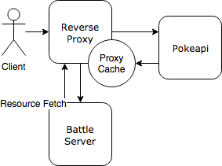

# Pokemon App
This respository couples the Rails server implemented in [Pokemon Battle Rails](https://github.com/aglorei/pokemon_battle_rails/) with a Nginx reverse proxy that implements a [proxy cache](https://www.nginx.com/blog/nginx-caching-guide/) for requests that fetch upstream information from [Pokeapi](https://pokeapi.co/). Since requests from the battle server are passed through the reverse proxy and collected in cache, the strain towards hitting Pokeapi's rate-limiting threshold is eased.



## Quick Start
### Prerequisites
- [Docker](https://docs.docker.com/install)
- [Docker Compose](https://github.com/docker/compose/releases)
### Install
```
git submodule update --init --recursive
docker-compose up
```
### Show Pokemon Passthrough
```
curl localhost:8080/api/v2/pokemon/1/
```
### Show Move Passthrough
```
curl localhost:8080/api/v2/move/1/
```
### Create Battle
```
curl -X POST \
  -H 'Content-type: application/json' \
  -d '{"pokemon1": "pikachu", "pokemon2": "charmander"}' \
  localhost:8080/battle
```
### Tests
```
docker-compose run --rm \
  -e RAILS_ENV=test \
  battle_service \
  bundle exec rake test
```
### Code Analyze ([Rubocop](https://github.com/bbatsov/rubocop))
```
docker-compose run --rm \
  -e RAILS_ENV=development \
  battle_service \
  bundle exec rubocop
```

## Pokemon
### GET /api/v2/pokemon/{id or name}/
This is a passthrough-endpoint. Please reference the [Pokeapi Documentation](https://pokeapi.co/docsv2/) for more details
## Move
### GET /api/v2/move/{id or name}/
This is a passthrough-endpoint. Please reference the [Pokeapi Documentation](https://pokeapi.co/docsv2/) for more details
## Battle
### POST /battle
| Field | Type | Description |
| --- | --- | --- |
| `pokemon1` | {id or name} | ID or name of Pokemon assigned as offensive in the first round |
| `pokemon2` | {id or name} | ID or name of Pokemon assigned as defensive in the first round |
### Sample Response
```JSON
{
  "winner": "Charmander",
  "history": [
    "Pikachu has an hp of 35.0.",
    "Charmander has an hp of 39.0",
    "Pikachu attacked Charmander with 'Take-down' for a damage of 9.0.",
    "Charmander is left with an hp of 30.0.",
    "Charmander smacked Pikachu with 'Secret-power' for a damage of 7.0.",
    "Pikachu is left with an hp of 28.0.",
    "Pikachu slapped Charmander with 'Rollout' for a damage of 3.0.",
    "Charmander is left with an hp of 27.0.",
    "Charmander slapped Pikachu with 'Shadow-claw' for a damage of 7.0.",
    "Pikachu is left with an hp of 21.0.",
    "Pikachu attacked Charmander with 'Swift' for a damage of 6.0.",
    "Charmander is left with an hp of 21.0.",
    "Charmander knocked Pikachu with 'Leer' for a damage of 0.0.",
    "Pikachu is left with an hp of 21.0.",
    "Pikachu slapped Charmander with 'Bide' for a damage of 0.0.",
    "Charmander is left with an hp of 21.0.",
    "Charmander slapped Pikachu with 'Shadow-claw' for a damage of 7.0.",
    "Pikachu is left with an hp of 14.0.",
    "Pikachu attacked Charmander with 'Submission' for a damage of 8.0.",
    "Charmander is left with an hp of 13.0.",
    "Charmander attacked Pikachu with 'Headbutt' for a damage of 7.0.",
    "Pikachu is left with an hp of 7.0.",
    "Pikachu slapped Charmander with 'Thunderbolt' for a damage of 9.0.",
    "Charmander is left with an hp of 4.0.",
    "Charmander attacked Pikachu with 'Rock-slide' for a damage of 7.5.",
    "Pikachu is left with an hp of 0.0.",
    "Charmander is the triumphant winner."
  ]
}
```
